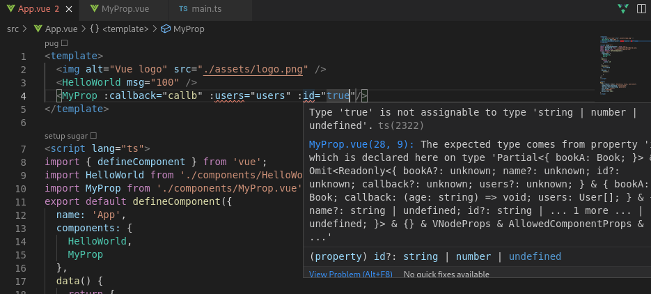

# Aug 08 随记
> 这是随记的第一篇。虽然放在daily文件夹但可能不是每天都回去写，这里主要还是记录晚上学习到的东西。今天就是从Vue3
> 开始，毕竟Vue3也出来好一阵子了

## Typesciprt 支持
### 非 Class 的写法
貌似 Vue3 已经 把 `Typescript` 提示做得非常好了，配合上 `Volar`插件，实现了之前一直很需要的功能，对模板有很大的提升。
#### Props
`Props` 的语法定义应该是 `Vue` 中比较复杂且重要的了，`Vue` 的 `SFC` 不同于`React` 的`JSX`，本身就是几个部分的糅合，却不像
`React` 更偏向 `JS`，这也导致了 `SFC` 模块之前的使用一直很难做好参数类型提示。 \
Demo:

```ts
interface User {
    name: string;
    age: number;
    coin: number;
}
interface Book {
    title: string
    year?: number
}
function isBook(book: unknown): book is Book {
    return Object.prototype.hasOwnProperty.call(book, 'title')

}
export default defineComponent({
    props: {
        bookA: {
            type: Object as PropType<Book>,
            default: () => ({ title: 'Arrow' }),
            validator: (book: unknown) => isBook(book)
        },
        name: String,
        id: [Number, String],
        callback: {
            type: Function as PropType<(age: string) => void>,
            required: true
        },
        users: {
            type: Array as PropType<Array<User>>
        }
    },
    mounted() {
        this.users?.[0].age
    }
});
```
由于 `Vue` 并不是始终用 `Typescript`,所以在 `Prop` 的类型标注中并不能使用`ts`的标注方法，虽然可以使用`反射`模块来动态获取`ts`的类型
标注，不过这绝对是不现实的。 

```html
<template>
  <HelloWorld msg="100" />
  <MyProp :callback="callb" />
</template>

```
从使用的角度来说，`volar` 支持对参数类型的检测，`required`的要求等,能够在编写模板变量时自动提示，跳转定义。已经是非常好用了。图中对 `users` 和 `id` 类型错误进行报告。


#### emits 标注
``` ts
const Component = defineComponent({
  emits: {
    addBook(payload: { bookName: string }) {
      // perform runtime 验证
      return payload.bookName.length > 0
    }
  },
  methods: {
    onSubmit() {
      this.$emit('addBook', {
        bookName: 123 // 类型错误！
      })
      this.$emit('non-declared-event') // 类型错误！
    }
  }
})
```

#### setup
