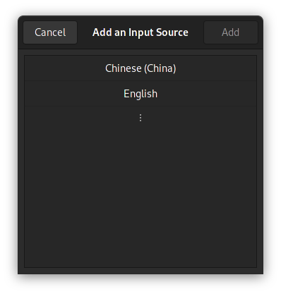
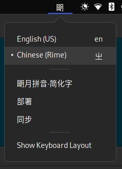
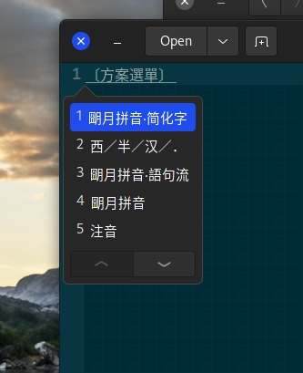
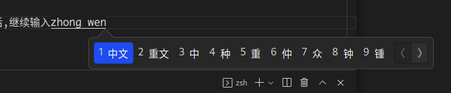
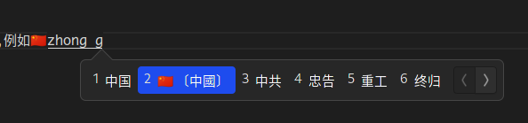

# 生日
>题外话: 今天按照农历来说时 八月十三, 我的生日, 刚刚阳历生日是工作日,今年就是今天了🎂(虽然并没有蛋糕).

> 今天想记录一下 rime 输入法的配置,自己也是一直能用就行,多少还是有些不是很顺手. 今天就啃一啃他的文档吧(有一说一 `rime` 的文档确实有点拉胯了).
> 然后我自己平时工作之余写代码用的是16吋的笔记本,没外接键盘(桌子太小),键位相对于标准键位来说有一些小调整,总体是没去别的.


## 安装 
> 我用的是 Archlinux 所以直接用下面的命令就可以了, rime 在各个发行版本里面应该都有,所以安装不成问题
> ```bash
> pacman -S librime ibus-rime
> ```

## 激活
如果是第一次安装输入法的话, 我们还需要注销一下当前登录, 让 `ibus` 来识别到我们新加的输入法
然后在 `Keyboard`-`Input Sources` 里面找到我们 `Rime` 输入法即可. \
. \
最后我们要在状态栏选择 `Rime` 输入法 \
 \
> 其实这个时候 rime 已经能用了, 我们只需要在配置一下就基本满足日常了

## 基础配置
我们可以打开一个文本编辑器, 按下 `F4` \


> 用上下键选择想要的输入方式即可,我用的则是 `朙月拼音*简化字`, 我还修改了中文输入下的标点符号,统一成半角的,这样就省很多事了

## 高级配置
配置路径: `~/.config/ibus/rime`
初次安装`rime`之后,这个路径是空的或者不存在,我们可以手动创建 `mkdir ~/.config/ibus/rime`
### 配置文件
`rime` 用一个 `default.custom.yaml` 的文件来做自定义配置,创建它并添加以下内容
``` yaml
# --- default.custom.yaml ---
patch:
  "menu/page_size": 9
```
然后在输入法面板中点击 `部署`,完成之后我们输入中文就可以看到待选词变成了9个.
> ### [如何使用横向布局?](https://github.com/rime/ibus-rime/issues/52)
> ibus-rime 默认使用垂直候选列表, 这和在很多人在 `Windows` 上的其他输入法体验不同, 原本的配置`style/horizontal: true` 目前并不能调整. 我们需要去调整 `ibus` 的设置. \
> 添加一下内容到 `~/.config/ibus/rime/build/ibus_rime.yaml` (如果已存在可以找到对应位置修改)
> ``` yaml
> style:
>   horizontal: true
> ```
> 然后在 `rime` 的配置页面点击 `部署`之后,继续输入中文即可看到设置生效了.
>  \
> ### 优化
> 上面的方法其实需要手动去改自动生成的文件,如果我们用 `git` 工具同步我们的配置那么,上面的设置肯定是没办法
> 同步的, 因此我们可以仿照我们之前的 `*.custom.yaml` 的方式,创建一个名为 `ibus_rime.custom.yaml` 文件
> 和之前的 `*.custom.yaml` 在同一文件夹, 然后添加一下内容
> ``` yaml
> patch:
>  style/horizontal: true
> ```
> 重新 `部署` 输入法, 就可以自动更新我们的设置了,类似其他相关的 `ibus` 配置都可以在这里配置.

#### 理解配置文件
上面几个配置文件都有几个共同点:
1. 文件名都是以 `custom.yaml` 结尾的
2. 文件内容都是在 `patch` 下的
   
这些设定帮助我们可以通过类似补丁的方式来对 `rime` 进行拓展, 而无需从一个巨大的配置文件开始, 但如果我们想要了解更多 `rime` 的配置我们就需要打开 \
`~/.config/ibus/rime/build/default.yaml` 文件, 这个文件则是应用了我们编写的补丁的较为完整的配置文件. 其中包含了一些之前没有见过的内容, 如 `key_binder/bindings` 用于设置快捷键, `punctuator/full_shape`, `punctuator/half_shape` 用于描述标点符号.
在[这里](https://github.com/rime/home/wiki/CustomizationGuide#%E5%AE%9A%E8%A3%BD%E6%8C%87%E5%8D%97)获取更详细的介绍.

### 词库&emoji
`rime` 提供了一个非常强大的工具 [`plum`](https://github.com/rime/plum), 来提供复杂的配置管理.
#### 安装
```bash
curl -fsSL https://git.io/rime-install | bash
```
脚本会自动在我们用户目录下clone `plum` 并执行初始的配置安装, 同时可以将`~/plum`添加到`PATH`中,这样我们就可以很方便使用`rime_install` 指令了
### 配置
如果我们是使用默认安装的话,会发现原本的配置目录下多了特别多文件,他们多数都是以 `schema.yaml` 结尾. \
找到并打开 `luna_pinyin_simp.schema.yaml` 和 `default.yaml` 文件.  可以看出来这些文件都是我们最终构建出的配置文件模板, 由于我只使用`luna_pinyin`所以我删除了其他几个如仓颉的配置. 如果我们打开`luna_pinyin.schema.yaml` 就可以看到完整的`luna_pinyin`的配置,而之前的`_simp`只是基于这个配置加了繁简转换罢了. 有兴趣的小伙伴可以自行学习一波.
> ### 移除不需要的输入配置
> 如果我们只是删除掉配置目录下的`schema.yaml`文件的话,后续我们安装新的`plum`包时还是会把那几个包给安装上,
> 这个时候我们就需要去到`~/plum/preset-packages.conf` 注释掉我们不需要的包
> ``` bash
> #!/bin/bash
>package_list+=(
>#    bopomofo
>#    cangjie
>    essay
>    luna-pinyin
>    prelude
>#    stroke
>#    terra-pinyin
>)
> ```
#### Emoji
在终端中执行 `rime-install emoji`, 完成之后再执行`rime-install emoji:customize:schema=luna_pinyin_simp`即可以自动应用 `emoji` 的配置. \
注意生成的配置文件`luna_pinyin_simp.custom.yaml`, 和我们之前所编辑的都不太一样,多了两行注释, 这里主要是给`plum`使用的.
``` yaml
__patch:
# Rx: emoji:customize:schema=luna_pinyin_simp {
  - patch/+:
      __include: emoji_suggestion:/patch
# }
```
重新部署之后我们便可以输入emoji了,例如🇨🇳

但是此时我们发行 `emoji` 后面注释的中文是繁体, 这是因为 `emoji_suggestion.yaml`的添加 `simplifier@emoji_suggestion` 引擎被放在了第一位. 如果你喜欢简化字的话只需要将 `emoji_suggestion.yaml`替换为一下内容即可,这样 `emoji` 就可以在简化字后面出现了. 
``` yaml
# encoding: utf-8

patch:
  switches/@next:
    name: emoji_suggestion
    reset: 1
    states: [ "🈚️️\uFE0E", "🈶️️\uFE0F" ]
  'engine/filters/+':
    - simplifier@emoji_suggestion
  emoji_suggestion:
    opencc_config: emoji.json
    option_name: emoji_suggestion
    tips: all

```
一波 `emoji` 袭来: \
🤟🏻 🙋🏻 🎆 🌕 🎉 🥳

#### 词库