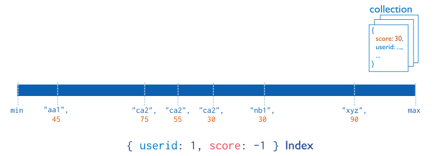

# Indexes/索引
> 之前在 `Mongodb in action` 一书中了解了 `Mongodb` 的索引, 但是考虑到该书是基于 `Mongodb` 3.0 版本的,所以
> 基于现有的认知, 配合 `Mongodb` 手册,做一些笔记. 

## 创建索引
> MongoDB indexes use a [B-tree](https://zh.wikipedia.org/wiki/B树) data structure.
```js
collection.createIndex({
    name: -1
}, { name: "query for inventory" }, (error, result) => {

})
db.collection.getIndexes()
```

## 索引类型
### Single Field

```js
db.records.createIndex( { score: 1 } )
db.records.createIndex( { "location.state": 1 } ) // Index on an Embedded Field
``` 
### Compound Index

> `Single Field` 索引的排序方式 `Sort Order` 的选择并不会有太大区别, 而 `Compound Index` 索引
> 排序方式的选择可能会导致一些排序操作不能使用
```js
db.products.createIndex( { "item": 1, "stock": 1 } )
```
> `组合索引`中索引键的顺序是很重要的.  `The index will contain references to documents sorted first by the values of the item field and, within each value of the item field, sorted by values of the stock field.`
>  同时`组合索引` 也可以使用第一个索引键进行索引(或者按[顺序的组合](https://docs.mongodb.com/manual/core/index-compound/#prefixes) 1, 1-2, 1-2-3).
``` js
db.events.createIndex( { "username" : 1, "date" : -1 } )
db.events.find().sort( { username: 1, date: -1 } ) // 支持
db.events.find().sort( { username: -1, date: 1 } ) //支持
db.events.find().sort( { username: 1, date: 1 } )  // 不支持
```
* Multikey Index
  
    > 对数组进行索引时 `Mongodb` 则会使用 `Multikey Index`, 并且`Multikey Index` 会对数组里面的每一个
    > 元素生成索引, 因此在查询数组内元素时可以直接像普通查询一样. 
    > [Index Arrays with Embedded Documents](https://docs.mongodb.com/manual/core/index-multikey/#index-arrays-with-embedded-documents)
* Geospatial Index
    > 地理索引
* Text Indexes
  > 文本索引
* Hashed Indexes
  > 哈希索引,基于哈希值的索引,类似编程语言中的`Map`结构,只能做相等查询,没有范围查询.但是有较好的随机分布.

## 索引属性
1. Unique Indexes
    > 唯一索引
2. Partial Indexes (v3.2)
   > 部分索引, 可通过表达式来对文档进行过滤,只索引需要的文档. 部分索引能够提供 `Sparse Index` 稀疏索引的功能,并且提供给更好的性能
3. Sparse Indexes
   > 稀疏索引会跳过不包含索引键或值为`null`的文档, 通常可以配合`Unique Indexes`.
4. TTL Indexes
   `TTL Indexes` 可以用于实现自动删除文档的功能
5. Hidden Indexes
   > `Hidden Indexes` 用于"临时"取消一个索引, 以此来判断该索引是否对某些查询有效,无需移除该索引.

## Indexes and Collation
[details](https://docs.mongodb.com/manual/indexes/#indexes-and-collation)

## Indexes Limits
[details](https://docs.mongodb.com/manual/reference/limits/#std-label-index-limitations)
## Reference
1. [Mongodb Manual](https://docs.mongodb.com/manual/indexes/)