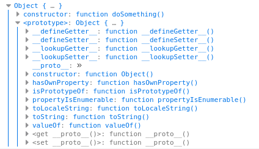
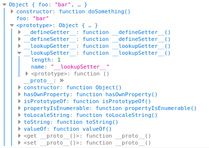
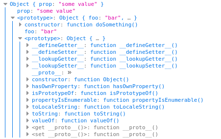

# Prototype
## 基于原型的语言
> 每个对象拥有一个原型对象，对象以其原型为模板、从原型继承方法和属性。
> 原型对象也可能拥有原型，并从中继承方法和属性，一层一层、以此类推。这种关系常被称为原型链 (prototype chain)，它解释了为何一个对象会拥有定义在其他对象中的属性和方法。

##　函数的原型属性
> 每个函数都有一个特殊的属性叫作原型（prototype）
> ``` js
> function doSomething(){}
> console.log( doSomething.prototype );
> ```
>
> 
> 以上便是 `doSometing`这个函数的 `原型` 属性

### 修改原型
``` js
function doSomething(){}
doSomething.prototype.foo = "bar";
console.log( doSomething.prototype );
```


### 创建实例
> 我们可以使用 new 运算符来在现在的这个原型基础之上，创建一个 `doSomething` 的实例
```js
function doSomething(){}
doSomething.prototype.foo = "bar"; // add a property onto the prototype
var doSomeInstancing = new doSomething();
doSomeInstancing.prop = "some value"; // add a property onto the object
console.log( doSomeInstancing );
```
 \
此时可以看到 `doSomeInstancing` 的输出中第一项`constructor`是这个实例的`构造函数`，也就是`doSomething`函数，第二项`prop`这是我们手动为这个实例添加的一个属性。而其中一个最关键的属性便是`<prototype>`,以往我们使用`a.__proto__`来访问到这个属性，但其实这并不是一个标准定义。这个属性则是实现继承的核心，它其实就是构造函数的`prototype`，也就是`doSomething.prototype`，也是我们这个实例的`doSomeInstancing.constructor.prototype == doSomeInstancing.__proto__`。\

当我们想要从这个实例中获取`foo`这个属性时，JS会首先在当前实例属性中去寻找，如果没有则会找到这个实例的构造函数原型属性中去找，也就是`doSomething.prototype.foo`,如果还找不到就会在这个原型的原型上去找。\

比如 `doSomeInstancing.toString` 这个函数其实有 `Object.prototype.toString == doSomeInstancing.toString` ,这是因为 `doSomeInstancing.toString -> doSomeInstancing.__proto__.toString -> doSomeInstancing.__proto__.__proto__.toString` ,且 `doSomeInstancing.__proto__.__proto__ == doSomething.prototype.__proto__ == Object.prototype`

## 继承发生在 `prototype`
上面例子中 `doSomeInstancing` 包含从`Object`中继承了 `toString` 方法，但其实 `Object` 这个构造函数(类) 还有类似`Object.keys` 这样的函数，它们没有被继承下来，这是因为它们时直接"依附"在 `Object`之上，可以理解为`Java`中的静态函数,而只有在`Object.prototype`中定义的属性才会被继承

> 注意: The `prototype` property is one of the most confusingly-named parts of JavaScript — you might think that it points to the prototype object of the current object, but it doesn't (that's an internal object that can be accessed by `__proto__`, remember?). `prototype` instead is a property containing an object on which you define members that you want to be inherited.


### Object.create
```js
var person2 = Object.create(person1);
person2.__proto__ == person1
``` 
> `create()` 实际做的是从指定原型对象创建一个新的对象。这里以 `person1` 为原型对象创建了 `person2` 对象
### 手动实现继承
```js
let a = {} // 创建一个空对象
a.foo = "zz"
let b = {} // 创建另一个空对象
b.__proto__ = a // 设置 b 的 原型
console.log(b.foo == "zz")
```