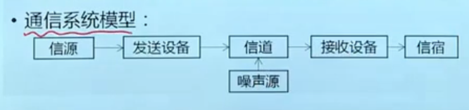

# 数据通信基础

## 1. 数据通信的基本概论
* **信息**是对事物状态或存在方式的不确定性表述。信息可以度量，其大小与消息的不确定性，即概率成反比。
* **通信的本质**就是在一点精确或近似地再生另一点的信息
* 信号：在通信系统特别是电通信系统，传递信息需要有适合的载体在传输通道中传播，这个载体就是信号
* **数据**是对客观事物的性质状态及相互关系等进行记载的物理符号及其组合，可以是数字、文字和图像等
* 通信系统: 能过实现通信功能的各种技术、设备和方法的总体被称为通信系统
    * 通信系统可以分为*模拟通信系统*和*数字通信系统*，区别在于信道中传输的是模拟信号还是数字信号
    * **数字通信系统**指的是信道中传输的信号是离散的*数字*信号
    * **数据通信系统**在信源和信宿端处理的是二进制数据，但是在信道传输的既可以是模拟信号也可以是数字信号

## 2. 数据传输方式
* 方向划分
    * 单向/单工通信
    * 双向交替通信/半双工通信：无线电对讲机
    * 双向同时通信/全双工通信
* 数据传输方式分为：
    * 并行通信：为每一个位都设置一个传输通道，全部bit同时进行传送。速度快，消耗材料多，不适合长距离传输
    * 串行通信：只设置一条通道，数据的一个字节中的每一bit依次在这条通道上传输。 速度相对较慢，适合长距离传输
### 同步技术
* 同步技术是指通信系统中实现收发两端动作统一、保持收发步调一致的过程；
* 两种同步技术的区别在于，收发两端的时钟是独立的还是同步的。
* 异步式同步：以字符为单位发送，无需同步时钟信号，使用起始位和停止位，无数据一直发停止位；
    * 不需要在收发两端间传输时钟信号，实现简单，但是传输效率低
* 同步式同步：以数据块为单位发送，需要建立同步时钟，数据块使用起始标志和结束标志
    * 需要建立同步时钟实现复杂，传输开销小，适合传输系统

* 基带传输、频带传输
    * 以计算机作为信源的原始数据信号称为**基本频带信号**，用固定的高低电平来表示二进制数字 1 或者 0 ，简称基带信号
    * 基带传输：直接在信道中传输基带信号
    * 以太网、令牌环网等计算机局域网都是采用基带传输
    * 频带传输：在信道中传送从经过调制的*载波信号*实现将基带信号所携带的信息传送出去的方式
    * 调制方式：调幅、调频、调相

## 3. 数据通信系统的性能
### 指标
* 有效性、可靠性、适应性、经济性、可维护性
* 有效性指标：带宽（模拟系统）、码元速率、信息速率和频带利用率（数字系统）
* 可靠性指标：信噪比（模拟系统）、误码率（数字系统）
* 信噪比：即接收端最终输出有用信号的功率和噪声功率的比值来度量。模拟通信系统中，*可靠性*使用信噪比,越大越好。

### 码元速率 $R_B$
* 码元：在数字系统中，用时间间隔相同的符号来表示一个离散值，这样的时间间隔内的信号称之为码元（一个脉冲），时间间隔为码元长度
即波特率 单位为波特 Baud ，若码元长度为 $T(s)$，则
$$R_B = 1/T$$

### 信息速率/比特率 $R_b$
即每秒传送的二进制比特数，单位为比特/秒，
规定一个二进制码元含1bit信息，则一个四进制码元携带2bit数据量，一个M进制码元携带$log_2M$比特信息量，有如下换算关系
$$R_b=R_Blog_2M$$

某八进制信号，码元速率为 1200Baud 则，信息速率为 3600bit/s

### 频带利用率 
反映信道带宽的占用情况
$$\eta=\frac{R_b}{B}$$
或
$$\eta=\frac{R_B}{B}$$
其中 B 为数字通信系统的信号带宽

### 误码率和误比特率
* 误码率：接收到的错误码元数载所传输的总码元数中所占的比例

$$P_e=\frac{N_e}{N}$$
    其中$N$为传输码元总数、$N_e$为错误码元数

* 误信率：指接收到的错误比特数在所传输的总比特数中所占的比例
$$P_b=\frac{N_e^b}{N^b}$$
    其中$N^b$为传输比特总数、$N_e^b$为错误比特数

### 信道极限容量
根据香农公式（极限信息传输速率），单位为 (bit/s)
$$C=Wlog_2(1+S/N)$$
* C为极限信息传输速率
* W为信道的带宽Hz
* S为信道内所传信号的平均功率
* N为信道内的高斯噪声功率
## 4. 传输信道
* 信道：通信系统中连接发送端与接受端的通信设备，实现从发送端到接受端的信号传送
### 有线信道
* 架空明线、双绞线、同轴电缆、光纤
* 架空明线：平行且相互分离或绝缘的架空裸线线路
    * 长距离传输最高频率150kHz，最高可达300kHz
    * 优点：传输损耗低；缺点：易受天气和外界干扰，带宽有限
* 双绞线两根绝缘的铜线按照一定密度相互绞合在一起
    * 分为 非屏蔽UTP和屏蔽STP
    * 常用的是三类（10Base-T，7.5cm到10cm绞合长度）和 五类（100BASE-T，0.6cm到0.85cm绞合长度）非屏蔽双绞线
    * 双绞主要用于*基带传输*
* 同轴电缆：两个同心导体，导体和屏蔽层共用同一轴心的电缆
    * 基带同轴电缆用于传统总线型以太网，50欧姆
    * 宽带同轴电缆用于有线电视，75欧姆
    * 带宽可达1GHz
* 光纤分为单模光纤和多模光纤
    * 纤芯的折射率 **大于** 包层的折射率，进入纤芯的光会在两层的边界发生全反射
    * ^^阶越型光纤^^：光波只在边界发生反射
    * ^^梯度型光纤^^：折射率沿着半径增大的方向逐渐减小
    * 多模：使用发光二极管作为光源，传输带宽窄
    * 单模：使用激光器作为光源
### 无线信道
* 无线信道利用电磁波在空间的传播来传输信号
* **国际电信联盟ITU** 负责制定无线电频率的使用的国际协议
* 电磁波又可以分为 视线传播、地波、天波（电离层反射波）

| UTP类别 | 带宽   | 应用                |
| ------- | ------ | ------------------- |
| 3       | 16MHz  | 低速网、电话网      |
| 4       | 20Hz   | 10BaseT             |
| 5       | 100MHz | 10BaseT，100BaseT   |
| 5E      | 100MHz | 100BaseT，1000BaseT |
| 6       | 250MHz | 1000BaseT，ATM网络  |

## 5. 数据通信中的编码
* 载波 carrier wave：通常把能在模拟信道中传输的模拟信号称为载波，一般表述为
$$y(t)=Asin(\omega t+\varphi)$$
A 为振幅、$\omega$ 为频率、 $\varphi$ 为模拟信号的初始相位 
* 调制：的基本思想是通过载波信号的振幅、频率、初始相位这三个参数的变化来表示0和1两种符号，从而将原始的二进制数据变换成数字脉冲序列从而实现基带传输的方法
  * ASK 振幅键控，容易实现，抗干扰能力差
  * FSK 频移键控，容易实现，抗干扰能力强
  * PSK 相移键控
  * QAM 正交振幅调制
  * OFDM 正交频分复用
* 数字数据编码所使用的信号码型（P43）：
    * 单极不归零码NRZ：简单、计算机内部或外设之间短距离
    * 双极不归零码：ITU-T的V.24、RS-232C
    * 单极归零码RZ：正电平在中间位置归零
    * 双极归零码
    * 差分码：0电平无跳变，1电平有跳变
    * 双相码/曼彻斯特码：中间时刻：负电平跳正电平为0，正电平跳负电平为1，跳变可以用来同步
    * 差分双向码：中间跳变，开始处无跳变为0，有跳变为1
    * 多元码:将二进制数据映射为多进制信号。一般的将k个二进制信号映射为M=2^k个离散的脉冲幅值
### 模拟信号转数字信号并进行传输流程
* 将模拟信号转换为数字信号 （A/D转换）
* 将数字信号基带传输或调制传输
* 将数字信号还原成模拟信号（D/A转换）
### A/D转换流程
* 抽样：以一定的时间间隔采集模拟信号的瞬间值
* 量化：根据某种规则将采用得到的瞬间值用数值表示出来
* 编码：将量化得到的数值变换成一组二进制编码
### 抽样定理
* 如果模拟信号范围为 $f_l - f_h$，则信号带宽为$B=f_h-f_l$,如果 $B>f_l$则为低通信号，即范围大于低频，否则则为带通信号
* **低通抽样定理**

以频率$f_s \ge 2f_h$ 即抽样间隔为$T\le \frac{1}{2f_h}$ 时抽样则信号抽样值完全确定，能够还原。 $f_s = 2f_h$ 称之为奈奎斯特速率，对应的抽样间隔为奈奎斯特时间间隔

* 带通抽样定理
$$f_s = 2B(1+\frac{k}{n})$$
其中 B 为 信号带宽，n 为$\frac{f_h}{B}$的整数部分 k为$\frac{f_h}{B}$ 的小数部分，$f_s$为能够被还原的最小抽样频率

### 脉冲编码调制PCM （P47）
* 采样：根据低通抽样定理进行抽样
* 量化：把幅度上连续的抽样信号进行幅度离散化
    * 均匀量化：等间隔分割取值域
    * 非均匀量化：非等间隔，随着抽样值的不同而不同
* 非均匀量化
    * A 律压缩和A 律压缩13折线；中国和欧洲
    * $\mu$律压缩和 $\mu$律15折线； 美国和日本
* 编码：采样信号经过量化后形成了*有限个*信号电平，将这些电平用二进制码组表示的过程称之为编码
    * 常用编码方式：自然二进制码、折叠二进制码、格雷二进制码
    * 在语音通信中一般采用 8 位的PCM编码和折叠二进制码
#### 折叠二进制码在语音编码上的优点
* 折叠二进制码对小信号时的误码影响小
* 语音信号中小信号出现的概率较大
* 折叠二进制码
    * 最高位代表极性
    * 正值则与自然二进制码相同
    * 负值则对应自然二进制位取反

## 6. 复用技术
* 频分多路复用 FDM：多个信号调制到对应的子信道的载波信号，多用于模拟传输
* 时分多路复用 TDM，可以细分为 同步STDM和异步ATDM
    * 便于信号数字化，实现数字通信
    * 制造调试容易，更适合采用集成电路实现
    * 生成成本较低，具有价格优势
    * 应用：时分制多路电话通信系统；中欧采用E体系，美日采用T体系
    * STDM：固定时序间隙
    * ATDM：根据数据量来分配时隙，没有数据就不分配，数据多就多分配
* 波分多路复用 WDM：本质也是频分复用，对应光的波长，光纤通讯中常用
* 码分多路复用 CDM：
    * 使用更长的相互正交的码组分别编码各路原始信息的每个码元，使得编码之后的信号在同一个信道中混合传输，接受端利用码组的正交特性分离各路信号。
    * 每个站点有一个N位码组 码片序列S，发送时使用S进行编码：发送1时发送码片序列S，发送-1（0）时发送S的反码。
    * 接收端解析i站点数据需要先获取对应的码片序列S，对数据进行运算获得1bit信息，1，-1表示对应数据，0表示没有数据. $\frac{1}{N}S_i P$（P55）

## 7. 差错控制技术
* 香农信道编码定理是数据通信差错控制的理论基础
### 差错控制
* 检错重发：发送端进行差错编码，接受端检测，出错接受端请求重发，所以也叫 ARQ 自动请求重传
    * 停止-等待 ARQ
    * 回退 N 步 ARQ
    * 选择性重传 ARQ
* 前向纠错：接受端可以定位到错误并直接纠正
* 反馈校验：接受端返回接收到的数据，发送端比对
* 检错丢弃：不纠错，直接丢弃
### 差错编码
* 划分 P59
    * 检错/纠错能力：检错码和纠错码
    * 数据信息与差错编码冗余信息关系：线性码（满足线性关系）和非线性码
    * 分组映射关系划分：分组码和卷积码
    * 数据信息在编码后是否变化：系统码和非系统码
    * 检错/纠错类型：随机错误检测/纠错码和突发错误检测/纠错码
* 奇偶校验码
    * 1位的冗余比特，使得数据编码后码字中的1的个数位奇数，就是奇校验
## 8. 交换技术
* 数据通信的根本目的是 在发送端和接收端之间实现相互的数据传输和信息交换
* 常见交换方式
    * 电路交换方式
    * 存储-转发交换方式：报文交换、分组交换
* 电路交换
    * 通过中间转换节点在两个通信设备之间建立一个专用的通信线路
    * 流程：建立电路、传输数据、拆除电路
* 20世纪40年代的电报系统使用的是存储-转发原理的报文交换
* 报文交换不需要建立连接
* 分组交换： 1964年8月巴兰提出，分组交换将报文分成若干个分组
    * 数据报分组交换：无连接，数据包顺序不一定
    * 虚电路分组交换：面向连接的，数据包顺序保持一致，无需排序。X.25、帧中继、异步传输模式ATM
    * 数据报/虚电路本质差别：是将差错控制、顺序控制、流量控制等通信功能交由通信子网完成还是端系统来完成