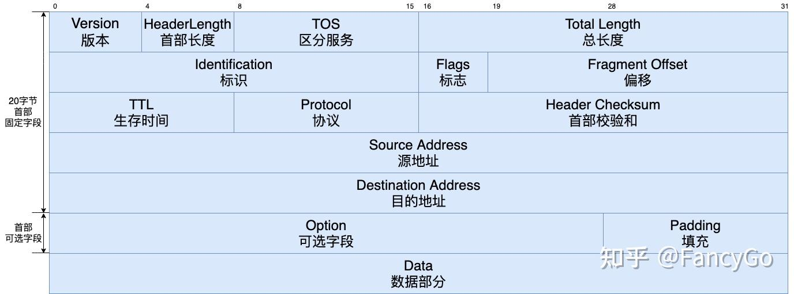
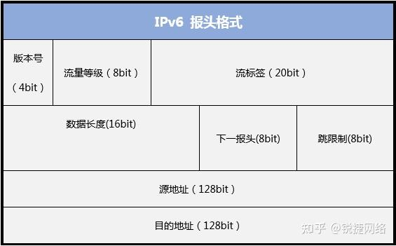

# B.总结

## 几个协议总结
### UDP 首部
```
 0                   1                   2                   3
 0 1 2 3 4 5 6 7 8 9 0 1 2 3 4 5 6 7 8 9 0 1 2 3 4 5 6 7 8 9 0 1
+-+-+-+-+-+-+-+-+-+-+-+-+-+-+-+-+-+-+-+-+-+-+-+-+-+-+-+-+-+-+-+-+
|          源端口              |          目标端口             |
+-+-+-+-+-+-+-+-+-+-+-+-+-+-+-+-+-+-+-+-+-+-+-+-+-+-+-+-+-+-+-+-+
|           长度               |           校验和              |
+-+-+-+-+-+-+-+-+-+-+-+-+-+-+-+-+-+-+-+-+-+-+-+-+-+-+-+-+-+-+-+-+
|                             数据                             |
+-+-+-+-+-+-+-+-+-+-+-+-+-+-+-+-+-+-+-+-+-+-+-+-+-+-+-+-+-+-+-+-+
```
* 16位源端口、目的端口、长度、校验和
* UDP 首部只有8个字节
* 一个UDP数据报最大长度为 65535B(包括首部)
### TCP 首部协议
```
 0                   1                   2                   3
 0 1 2 3 4 5 6 7 8 9 0 1 2 3 4 5 6 7 8 9 0 1 2 3 4 5 6 7 8 9 0 1
+-+-+-+-+-+-+-+-+-+-+-+-+-+-+-+-+-+-+-+-+-+-+-+-+-+-+-+-+-+-+-+-+
|          Source Port          |       Destination Port        |
+-+-+-+-+-+-+-+-+-+-+-+-+-+-+-+-+-+-+-+-+-+-+-+-+-+-+-+-+-+-+-+-+
|                        Sequence Number                        |
+-+-+-+-+-+-+-+-+-+-+-+-+-+-+-+-+-+-+-+-+-+-+-+-+-+-+-+-+-+-+-+-+
|                    Acknowledgment Number                      |
+-+-+-+-+-+-+-+-+-+-+-+-+-+-+-+-+-+-+-+-+-+-+-+-+-+-+-+-+-+-+-+-+
|  Data |           |U|A|P|R|S|F|                               |
| Offset| Reserved  |R|C|S|S|Y|I|            Window             |
|       |           |G|K|H|T|N|N|                               |
+-+-+-+-+-+-+-+-+-+-+-+-+-+-+-+-+-+-+-+-+-+-+-+-+-+-+-+-+-+-+-+-+
|           Checksum            |         Urgent Pointer        |
+-+-+-+-+-+-+-+-+-+-+-+-+-+-+-+-+-+-+-+-+-+-+-+-+-+-+-+-+-+-+-+-+
|                    Options                    |    Padding    |
+-+-+-+-+-+-+-+-+-+-+-+-+-+-+-+-+-+-+-+-+-+-+-+-+-+-+-+-+-+-+-+-+
|                             data                              |
+-+-+-+-+-+-+-+-+-+-+-+-+-+-+-+-+-+-+-+-+-+-+-+-+-+-+-+-+-+-+-+-+
```

* 一个 TCP 报文长度由链路层的MTU决定
* 确认号 (32 位): 希望从对方接受的字节序号，如果这个字节实际没有被收到，则表明之前的字节都已经接受到了。即 ^^累积确认机制^^
* 数据偏移 (4 位): 数据偏移量，指示 TCP 首部的长度（以 32位/4B为单位）。
* Flags (6 bits):
    * URG: 紧急指针有效。
    * ACK: 确认号有效。
    * PSH: 推送功能，接收方应立即将数据交给应用层。
    * RST: 重置连接。
    * SYN: 同步序列号，用于建立连接。
    * FIN: 结束连接。
* Window (16 bits): 窗口大小（字节），用于实现流量控制。
* Options：变长，
    * 最大段长度MSS，用来告知对方自己缓存所能接受的数据段的最大长度为MSS个字节，不包括首部
    * 窗口扩大选项
    * 时间戳选项
    * 选择确认 SACK
### TCP 建立连接中需要解决的问题、三次握手的作用
1. 要使得通信双方能够确认对方的存在
2. 要允许双方协商通信过程中的相关参数
3. 要能够对传输实体的资源进行分配
### TCP 三次握手过程
```
A->B: SYN=1,                     seq=x
B->A: SYN=1, ACK=1, ack_seq=x+1, seq=y
A->B: SYN=0, ACK=1, ack_seq=y+1, seq=x+1
```
### TCP 四次握手
```
A->B: FIN=1, seq=u
B->A: ACK=1, seq=v,   ack_seq=u+1
B->A: FIN=1, seq=w,   ack_seq=u+1
A->B: ACK=1, seq=u+1, ack_seq = w+1
```

### TCP 拥塞控制
* 包括: 慢启动、拥塞避免、快速重传和快速恢复 四个部分
* 拥塞窗口： cwdn
* 慢启动阈值：ssthresh
#### 慢启动
目的：探测网络可用带宽，避免突然发送大量数据导致网络拥塞。 

慢启动过程：

1.  初始将 cwnd 设置为一个较小的值，一般为 1 MSS
2.  每次收到一个 ACK 将 cwnd 增加 1 (个MSS), 呈指数级增长
3.  当 cwnd 达到 ssthresh 或发生丢包时，慢启动阶段结束
#### 拥塞避免
当 cwnd 达到 ssthresh 后，进入 拥塞避免 阶段

拥塞避免过程：

1. 每收到一个 ACK，cwnd 增加 1/cwnd MSS，呈线性增长。
2. 如果规定时间内未收到ACK，则认为 `网络超时`，将 ssthresh 设置为 $\frac{cwnd}{2}$, cwnd 设1
3. 重新进入慢启动


#### 快速重传和快速恢复
TODO
### 以太网帧格式
* 以太网V2（常用）
``` 
+-+-+-+-+-+-+-+-+-+-+-+-+-+-+-+-+-+-+-+-+-+-+-+-+-+-+-+-+-+-+-+-+-+-+
|  目的地址(6)  |  源地址(6)  | 类型(2) |    数据(46~1500)    | FSC(4) |
+-+-+-+-+-+-+-+-+-+-+-+-+-+-+-+-+-+-+-+-+-+-+-+-+-+-+-+-+-+-+-+-+-+-+
```
* IEEE 802.3
``` 
+-+-+-+-+-+-+-+-+-+-+-+-+-+-+-+-+-+-+-+-+-+-+-+-+-+-+-+-+-+-+-+-+-+-+-+-+
|  目的地址(6)  |  源地址(6)  | 类型/长度(2) |    数据(46~1500)    | FSC(4) |
+-+-+-+-+-+-+-+-+-+-+-+-+-+-+-+-+-+-+-+-+-+-+-+-+-+-+-+-+-+-+-+-+-+-+-+-+
```

* IEEE802.3：当类型/长度 小于 `0x0600`($1536_{10}$) 时表示 MAC 帧长度，否则表示的是上层协议的类型
* 首部+尾部 总共 `18B`
* 数据部分长度范围 `46~1500B`
* 一个有效帧的长度在: `64~1518B` 之间
### 以太网的 CSMA/CD 和 CSMA/CA
CSMA/CD 的核心思想：

* 采用“停止等待”的可靠传输方式，即发送方必须收到接收方的确认之后才能继续发送。如果在规定时间内没有收到确认，则认为数据丢失，需要重新发送.
* 采用虚拟载波监听机制，让发送方将它要占用信道的时间及时通知给其他所有站点，以便使其他站点在这一段时间都停止发送数据，从而大大降低碰撞的机会。
* 在信道从忙转为空闲时，各个站点要执行“退避算法”，等待一个随机的时间段后再发送数据，目的是减少发生碰撞的概率.
### VLAN 格式
* 插入VLAN标记的以太网帧格式
``` 
+-+-+-+-+-+-+-+-+-+-+-+-+-+-+-+-+-+-+-+-+-+-+-+-+-+-+-+-+-+-+-+-+-+-+-+-+-+-+-+-+-+
|  目的地址(6)  |  源地址(6) |  VLAN标记(4)  | 类型(2) |    数据(46~1500)    | FSC(4) |
+-+-+-+-+-+-+-+-+-+-+-+-+-+-+-+-+-+-+-+-+-+-+-+-+-+-+-+-+-+-+-+-+-+-+-+-+-+-+-+-+-+
```
* VLAN 标记 4个字节
``` 
+-+-+-+-+-+-+-+-+-+-+-+-+-+-+-+-+-+-+-+-+-+-+-+-+-+-+-+-+-+-+-+-
|  0x8100(16b)  | 用户优先级(3b) | CFI(1b) |  VLAN标识符VID(12b)  |
+-+-+-+-+-+-+-+-+-+-+-+-+-+-+-+-+-+-+-+-+-+-+-+-+-+-+-+-+-+-+-+-
```

* CFI 规范格式指示符

### IPV4 协议报文格式



* IPV4 最大分组长度为 `65535B`
* TTL 8位，表示可以通过的路由器跳数
* 最小IP分组首部为 `20B`, 理论最大可以封装 `65515B` 的数据
* 片偏移：单位8B，当前IP分片在源IP分组数据中的相对位置

### IPV6 协议报文格式
* IPV6 数据报
```
+-+-+-+-+-+-+-+-+-+-+-+-+-+-+-+-+-+-+-+-+-+-+-+-
|  基本首部 |  拓展首部1  | 拓展首部x |  数据报部分  |
+-+-+-+-+-+-+-+-+-+-+-+-+-+-+-+-+-+-+-+-+-+-+-+-
```
* 基本首部格式




* 基本首部长度为 40B
* 版本号 固定为 0110
* 通信业务类型/流量等级：用来区分不同IPV6数据报的类型或优先级

## IP 地址划分
### 分类划分
即按照 A B C D E，五类划分，IP地址表示方法

IP地址 = 网络号，主机号
### 子网划分
IP地址 = 网络号，子网号，主机号

### 无分类编制 CIDR
IP地址 = 网络前缀，主机号
## 常见的编码
##

## 数据报包的名字
* 物理层：比特流
* 链路层：帧
* 网络层：包或者分组
* 传输层：数据段或报文段
* 应用层：报文
