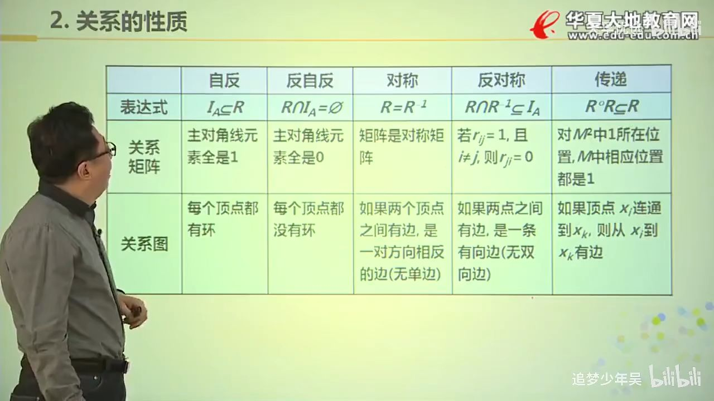

# 关系与函数
## 关系和定义
设A，B为集合，$A \times B$的任何自己叫做从A到B的二元关系，
当A=B时叫做A上的二元关系。简称关系，记作R。
若 $<x,y>\in R$，可记作$xRy$；若$<x,y> \notin R$,则记作$x\not R y$;
### 定义域、值域、域
> <x,y>
>
> 
* dom 定义域：所有的x
* ran 值域：所有的y
* fld 域：定义域并值域
### 几个特殊关系
设A 为任意集合 

空关系: $\empty$ 是A上的关系 

全域关系: $E_A = \{<x,y>| x\in A \land y\in A\} = A \times A$ 

恒等关系: $I_A = \{<x,x>|x \in A\}$

实例 $A = \{1,2\}$ 则有：

* $E_A = \{<1,1>,<1,2>,<2,1>,<2,2>\}$
* $E_I = \{<1,1>,<2,2>\}$
### 关系的表示：关系矩阵

设给定两个有限集合 X,Y, R为X到Y的关系，则关系矩阵$M_R = (r_{ij})_{m\times n}$, 其中

* $r_{ij} =1$ 当 $<x,y> \in R$
* $r_{ij} =0$ 当 $<x,y> \notin R$
### 关系的表示：关系图

## 关系的性质
设R是集合A上的关系
### 自反性
如果对$\forall a \in A$，必有 $aRa$, 则关系R在A上是自反的；即集合里面所有元素都和自己有关系

例子：
A上的全域关系 $E_A$, 恒等关系$I_A$,小于等于关系 $LE_A$, 整除关系$D_A$
### 反自反性
如果对$\forall a \in A$，必有 $a \not R a$, 则关系R在A上是反自反的；即集合里面所有元素都和自己没有关系

实例：实数集上的小于关系，幂集上的真包含关系
### 对称性
对$\forall a,b \in A$，若 $a R b$ 必有 $b R a$, 则关系R在A上是对称性；
> 即将关系中的任意一对数颠倒还在集合内的话，那这个集合则是对称关系

例子：
A上的全域关系$E_A$，恒等关系$I_A$和空关系
### 反对称性
对$\forall a,b \in A$，若 $a R b$ 且 $bRa$，必有$a=b$, 则关系R在A上是反对称性；

> 即集合中是否有 XRY YRX，如果有则判断x = y是否为真，如果为真则，这个集合为反对称关系，如果不为真，则不是反对称关系；如果集合中没有XRY YRX,则该集合为反对称关系，无法再判断X=Y。（类似但条件关系）；

$(若xRy,yRx) \rightarrow (x=y)$

例子：
A上的恒等关系$I_A$, 空关系(不存在任何关系)
### 传递性
对$\forall a,b,c \in A$，若$a R b$且$bRc$，必有 $aRc$, 则关系R在A上是传递的
> 也是类似但条件判断的方式，只有出现$aRb,bRc$但是没有$aRc$时才不是传递的

$(若aRb,bRc) \rightarrow (aRc)$

例子：
* 全域关系$E_A$,恒等关系$I_A$,空关系
* 小于等于关系、小于关系、整除关系、包含关系、真包含关系
### 例题
$A= \{1,2,3\}$，有
* $R_1 = \{<1,1>,<2,2>\}$; 不是自反；不是反自反
* $R_2 = \{<1,1>,<2,2>,<3,3>,<1,2>\}$; 是自反的；不是反自反的
* $R_3 = \{<1,3>\}$; 不是自反；是反自反的
### 例题2
$A= \{1,2,3\}$，有
$A= \{1,2,3\}$，有
* $R_1 = \{<1,1>,<2,2>\}$; 对称;反对称
* $R_2 = \{<1,1>,<1,2>,<2,1>\}$;对称；不是反对称的(存在<1,2>,<2,1> 且 2不等1)
* $R_3 = \{<1,2>,<1,3>\}$; 不是对称的；反对称的
* $R_4 = \{<1,2>,<2,1>,<1,3>\}$; 不是对称的；不是反对称的
### 表格

## 关系矩阵的布尔运算
### A和B的并 
$A\lor B = C = [c_{ij}]$

$$
c_{ij}=
\begin{cases}
1 & a_{ij}=1 或 b_{ij} = 1 \\
0 & a_{ij}=0 且 b_{ij} = 0
\end{cases}
$$
### A和B的交
$A\land B = C = [c_{ij}]$

$$
c_{ij}=
\begin{cases}
1 & a_{ij}=1 且 b_{ij} = 1 \\
0 & a_{ij}=0 或 b_{ij} = 0
\end{cases}
$$
### 布尔积
$A \odot B=C = [c_{ij}]$
$$
c_{ij}=
\begin{cases}
1 &\exist k, 1\le k \le n,\text{使得}a_{ik}=1\text{且}b_{kj}=1 \\
0 & \text(否则)
\end{cases}
$$
> $c_{00}$ 等于A第一行和B第一列，每个对应元素做合取再析取，所以只有要一组为1则这个位置为1，也可以理解成普通矩阵乘法，最后将大于1的数改为1
### 逆
$R^{-1} = \{ <y,x>| <x,y> \in R\}$  

### 布尔矩阵运算性质
$$
M_{R\cap S} = M_R \land M_S  \\
M_{R\cup S} = M_R \lor M_S  \\
{M_R}^{-1} = (M_R)^T
$$
### 复合运算
设R是A到B的关系，S是B到C的关系则定义

$$R \circ S = {<x,z>| \exist y(<x,y>\in R \land <y,z> \in S)}$$
称 $R \circ S$ 是 R和S的符合关系；是右符合

#### 性质
* $(F \circ G)\circ H = F \circ (G \circ H)$ 结合律
* $(F \circ G) ^{-1} = G^{-1} \circ F^{-1}$
* $M_{R \circ S} = M_R \odot M_S$
* $R^0 = I_A$
* $R^{n+1} = R^n \circ R$
### 闭包
$R'$是R的自反闭包要满足:
* $R'$ 是自反的
* $R\in R'$
* $R'$是所有A上的自反关系中最小的
#### 记法和求法
* 自反闭包 $r(R) = R\cup I_A$
* 对称闭包 $s(R) = R \cup R^{-1}$
* 传递闭包 $t(R) = R \cup R^2 \cup R^n$ 其中n为集合A中的树木

## 等价关系
* 设 R 为非空集合上的关系(Equivalence relation)，如果R是自反的、对称的和传递的，则称 R 为 A 上的 `等价关系`。
* 设 R 是一个等价关系，若 $<x,y>\in R$,则称 x 等价与 y，记作 `x~y`
### 集合的划分
设 $\pi = {S_1,S_2,...,S_n}$, 满足
* $\forall S_i \in \pi, S_i \subset A$
* $S_1 \cup S_2 ... S_n = A$
* $S_i \cap S_j = \emptyset$
则称 $\pi$ 是 集合 A 的一个划分 $S_i$ 为集合的划分快；每个划分块不相交；
### 等价类
设 R 为非空集合 A 上的等价关系, $\forall x \in A$, 令
$$[x]_R = \{y| y \in  A \land xRy \}$$
称 $[x]_R$ 为关于 R 的等价类，简称为 x 的等价类，简记为$[x]$

* $\forall x \in A$, [x] 是 A 的非空子集
* $\forall x,y \in A$, 如果 xRy, 则 `[x] =[y]`
* $\forall x,y \in A$,如果 $\not R y$,则 [x] 与 [y] 不交
* $\cup \{[x]|x \in A\} = A$ 所有等价类的并集就是A
#### 实例
A={1,2,...,8} 关于 模3等价,有
$$
[1] = [4] = [7]  = \{1,4,7\}\\
[2] = [5] = [8] = \{2,5,8\}\\
[3] = [6] = \{3,6\}
$$

### 商集
设 R 为非空集合 A 上的等价关系，以 R 的所有等价类作为元素的集合称为 A 关于 R 的商集，记作 $A/R = \{ [x]_R| x \in A \}$
#### 实例
A={1,2,...,8} 关于 模3等价关系 R 的商集为
$A/R = \{\{1,4,7\},\{2,5,8\},\{3,6\}\}$

商集 $A/R$ 就是 A 的一个划分

任给定意 A 的一个划分 $\pi$, 如下定义 A 上的关系 
$$R = \{<x,y>| x,y\in A \land x 与 y 在 \pi \text{的同一个划分块 }\}$$
则 R 为 A 上的等价关系，且该等价关系确定的商集就是 $\pi$

### 实例2
设 X = {1,2,3,4}, X的划分 S={{1},{2,3},{4}}，写出S 导出的等价关系R 

`R = {<1,1>,<2,2,>,<2,3>,<3,3>,<3,2>,<4,4>}`

## 序关系
非空集合 A 上的 自反、^^反对称^^和传递的关系，称为 A 上的 偏序关系(Partially ordered set),记作 $\preccurlyeq$，设 $\preccurlyeq$ 为偏序关系，如果 $<x,y> \in \preccurlyeq$, 则记为$x \preccurlyeq y$,读作 x 小于或等于 y

集合A 和 A上的偏序关系一起叫做偏序集，记作$<A,\preccurlyeq>$;

有限集合A 上的
* 恒等关系 $I_A$ 
* 小于等于关系，大于等于关系
* 整除关系
* 包含关系 $<P(A),\sube>$
### x,y可比
设 R 为 非空集合 A 上的偏序关系，
$\forall a,b \in A$, 若$<a,b> \in \preccurlyeq$ 且 $a \neq b$, 则称 $a \lt b$;

若 $<a,b> \in \preccurlyeq$ 或 $<b,a> \in \preccurlyeq$ 称 a 与 b 是可比的，否则称不可比的。

$x,y \in A$, x与y可比 等价于 $x\preccurlyeq y \lor y \preccurlyeq x$

### 全序关系
R 为非空集合 A 上的偏序关系， $\forall x,y \in A$,x 和 y 都是可比的，则称 R 为全序关系。

* 数集上的小于等于关系是全序关系；
* 整除关系 ^^不是^^ 整数集合上的全序关系；

### 覆盖
设R对A的偏序关系，$x,y \in A$, 如果 `x < y`,且不存在 $z \in A$ 使得 `x < z < y`，则称 y 覆盖 x；

$$COV A = \{<a,b>| a\in A \land b \in A \land b \text{覆盖} a\}$$

实例： 集合A= {1,2,4,6}上的整除关系,

有 {<1,1>,<1,2>, <1,4>, <1,6>,<2,2>, <2,4>,<2,6>, <4,4>,<6,6>}

CON A = {<1,2>,<2,4>,<2,6>}
### 拟序关系(quasi-order/preorder)
设A的R若是反自反，传递的则称R为A上的拟序关系，记为 $<A,\lt>$;  同时这个关系一定反对称的

### 特殊元素
设 $<A,\preccurlyeq>$ 为偏序集，$B \sube A, y \in B$
* 若$\forall x(x\in B \rightarrow y \preccurlyeq x)$成立，则称 y 为 B 的最小元
* 若$\forall x(x\in B \rightarrow x \preccurlyeq y)$成立，则称 y 为 B 的最大元
* 若$\neg \exist x(x\in B \land x \preccurlyeq y)$成立，则称 y 为 B 的极小元
* 若$\neg \exists x(x\in B \land y \preccurlyeq x)$成立，则称 y 为 B 的极大元

这四个特殊元素都是在 ==子集B== 的范围内规定的

设 $<A,\preccurlyeq>$ 为偏序集，$B \sube A, y \in A$
* 若$\forall x(x\in B \rightarrow x \preccurlyeq y)$成立，则称 y 为 B 的上界
* 若$\forall x(x\in B \rightarrow y \preccurlyeq x)$成立，则称 y 为 B 的下界
* 令 C={ y | y为B的上界 }，则称C的最小元为 B 的最小上界、上确界
* 令 D={ y | y为B的下届 }，则称C的最小元为 B 的最大上界、下确界