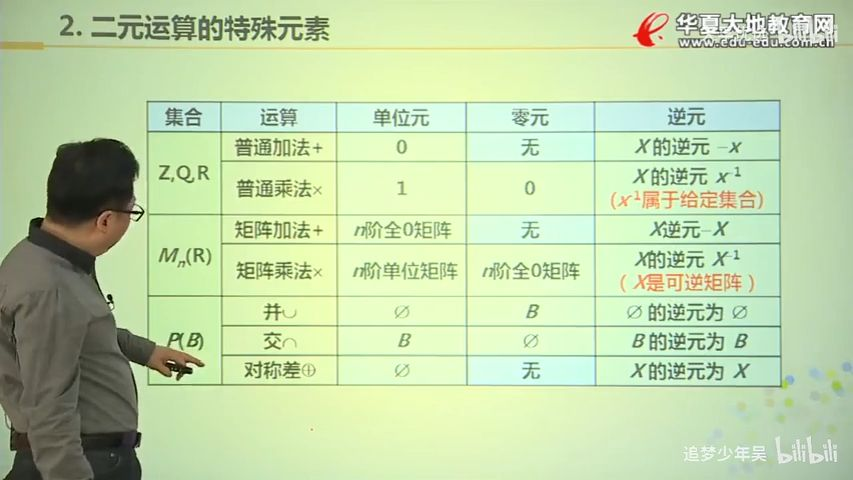

# 6.代数系统的一般概念
## 代数系统定义
### 二元运算
设 S 为集合，函数 $f: S \times S \rightarrow S$ 称为 S 上的二元运算，简称二元运算。也称 S 对 f 封闭

设 S 为集合，函数 $f: S  \rightarrow S$ 称为 S 上的一元运算，简称一元运算。
### 代数系统
一个非空集合 A， 连通若干个定义在该集合上的运算 $f_1,f_2,...f_n$ 所组成的系统，称之为一个代数系统，简称代数。记为：

$$<A,f_1,f_2,...,f_n>$$

!!! note
    ### 结合律

    * $x \circ (y \circ z) = (x \circ y) \circ z$

    ### 分配律：

    * $(x*y) \circ z = (x\circ z) * (y \circ z)$
    * $z \circ (x * y) (z \circ x) * (z \circ y)$
    
    则称 $\circ$ ==对== $*$ 运算满足分配律

    ### 吸收率

    * $x \circ (x * y) = x$
    * $x * (x \circ y) = x$
    * $A \land (A \lor B) = A$
    * $A \lor (A \land B) = A$
    
    则称 $\circ$ 和 * 运算满足 吸收率

    ### 消去律

    * $x \circ y = x \circ z$，且 x 不是零元，则 $y=z$
    * $y \circ x = z \circ x$，且 x 不是零元，则 $y=z$

    则称 $\circ$ 运算满足 消去律

### 一元二元运算的表示
* 算符： $\circ,*,$ 等符号

表示一元或二元的运算的方法
* 公式
* 运算表
  
## 幺元（单位元）
$e_l(er) \in S$ 使得任意 $x\in S$ 有

$e_l \circ x =x$ 或 $x \circ e_r  =x$

则称 $e_l$($e_r$) 为 S 中关于
$\circ$ 运算的 左（右） 单位元

##  零元
* ${\theta}_l \circ x = {\theta}_l$ 左零元
* $x \circ {\theta}_r  = {\theta}_r$ 右零元

## 可逆元素和其逆元
令 e 为 S 中关于运算 $\circ$ 的单位元。 对于 $x \in S$

* $y_l \circ x = e$ 左逆元
* $x \circ y_r = e$ 右逆元

如果 x 的逆元存在，就称 x 是可逆的

!!! 几个常见的集合的总结
    

## 半群
设 $V=<S,\circ>$ 是代数系统，$\circ$ 为二元运算， 如果 $\circ$ 运算是 

* 封闭的
* 可结合的

则称 V 为半群
### 半群元素的幂运算
* $x^1 = x$
* $x^{n+1} = x^n \circ n, n \in Z^+$
### 交换半群、独异点(Monoid)
* 若 $\circ$ 运算是可交换的，则称 V 为交换半群
* 若 $e \in S$ 是关于 $\circ$ 运算的 单位元，则称 V 是 含幺半群，也叫做独异点，记作 $V = <S,\circ, e>$

## 群
设 $<G,\circ>$ 是代数系统，$\circ$是二元运算，

* 如果 $\circ$ 运算是可结合的，
* 存在单位元 $e\in G$
* 并且对 G 中的任何元素 x 都有 $x^{-1} \in G$ (每个元素都有逆元)
则称 G 为群

!!! note
    * 封闭性 (代数系统)
    * 结合律
    * 有幺元
    * 每个元素都有逆元

!!! 群的实例
    * $<Z,+>,<Q,+>,<R,+>$ 是群； $<Z^+,+>,<N,+>$ 不是群
    * $<M_n(R),+>$ 是群；$<M_n(R),\cdot>$
    * $<P(B),\oplus>$是群，$\oplus$ 是对称差运算
    * $<Z_n,\oplus>是群$； Zn = {0,1,...,n-1}，$\oplus$ 是模n加

!!! note
    * 若群的二元运算是可交换的，则称为交换群或阿贝尔群
    * 群的阶就是群的基数，即群中元素的数量。有限群的阶记作 $|G|$

### 群元素的幂
设 G 为群，$x\in G, n\in Z$，则x的n次幂 $x^n$定义为

$$
x^n = 
\begin{cases}
e           & n = 0 \\
x^{n-1}x    & n > 0 \\
(x^{-1})^m  & m = -n,n < 0
\end{cases}
$$

### k阶元
使得等式$x^k = e$成立的最小正整数 k 称之为 x 的 ==阶或周期==,记作 $|x| = k$, 称 x 为 k阶元。

若不存在k，则称 x 为 ==无限阶元==。

### 性质
消去律

* ab = ac, 则 b = c
* ba = ca, 则 b = c

### 子群
H 是 G 的非空子集，若 H 关于 G 的运算也构成群则称 H 是 G 的子群，记作 $H \le G$

若 H 是G的子群且 $H \sub G$，则称之为真子群，记作 $H \lt G$

* 任何群 G 都存在 子群
* G 和 {e} 都是 G 的子群，被称作 ==平凡子群==

!!! 子群判断定理1
    * $\forall a,b \in H, 有 a*b \in H$
    * $\forall a \in H, 有 a^{-1} in H$

!!! 子群判断定理2
    * $\forall a,b \in H, 有 a*b^{-1} \in H$

!!! 子群判断定理3
    设 $<G,*>$ 为群，H 是 G 的 ==有穷非空自己==，$H\le G$ 当且仅当

    $\forall a,b \in H 有 a*b \in H$

### 生成子群
设 G 为群，\(a \in G\), 令 \(H=\{a^k|k \in Z\}\)，则 H 是 G的子群，称由 a 生成的子群，记作 \(<a>\)

!!! 关于 k
    如果 k 为负数，则运算的是 a 的逆元

> H是由 a 的所有 幂 构成的集合

!!! 实例
    对于整数加群 $<Z,+>$

    由 2 生成的子群是 $<2> = {2k| k \in Z} = {…,−4,−2,0,2,4,…}$

    对于 模6加群 $<Z_6,\oplus>$

    由 2 生成的子群 $<2> = {0,2,4}$

### 群的中心
设 G 为群，令 $C=\{a| a \in G \land 对 \forall x \in G 有 ax=xa \}$, 则称 C 是 G 的子群，称为 G 的中心，记作 CentG

* 对于可交换群/阿贝尔群，CentG = G
* 其他非交换群, CentG = {e}

### 循环群
设 G 是群，若存在 $a \in G$ 使得 $G = \{ a^k | k \in Z\}$，则称 G 是循环群，记作 $G = <a>$, 称 a 是 G 的生成元

!!! 实例
    * 整数加群 $G = <Z,+> = <1> = <-1>$
    * 模 6 加群 $G = <Z_6,\oplus> = <1> = <5>$

### 环
设代数系统 $<R,+,*>$ 是代数系统，+，* 是二元运算。若满足以下条件

* $<R,+>$ 构成交换群
* $<R,*>$ 构成半群
* `*` 运算 关于 `+` 适合分配律

则称 $<R,+,*>$ 是一个环

TODO： 域