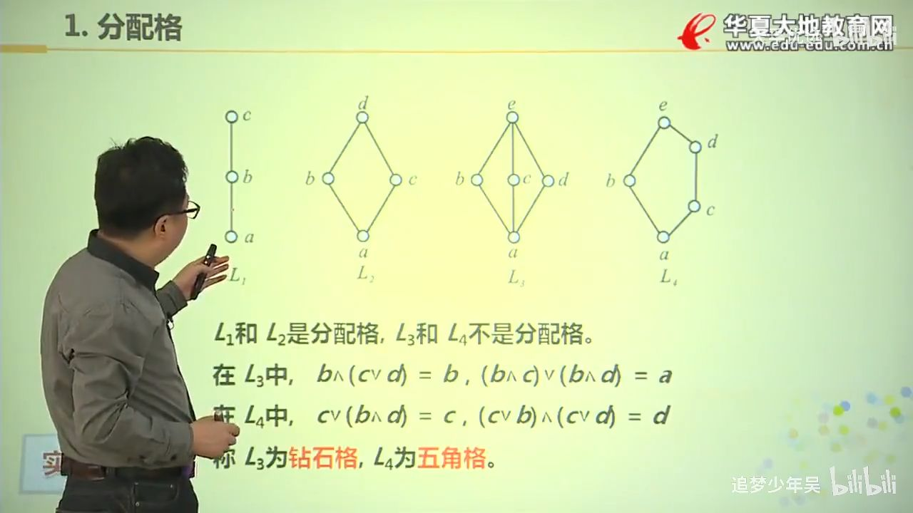

# 7.格和布尔代数

## 格 Lattice
!!! 命名
    “格”（Lattice）一词源于其哈斯图（Hasse diagram）的视觉特征：元素的连接方式形成类似格子的网状结构。这一术语由德国数学家Dedekind在19世纪研究理想（ideals）时引入。

设 $<S,\preccurlyeq>$ 是偏序集，如果 $\forall x,y \in S$, $\{x,y\}$ 都有最小上界，和最大下界，则称 S 关于偏序 $\preccurlyeq$组成一个格

定义两个二元运算 $\land,\lor$，能够实现

* 最小上界 = $x \lor y$ 
* 最大下界 = $x \land y$

则称 $<A,\land,\lor>$ 为由格 $<A,\preccurlyeq>$ 所诱导的代数系统，分别称为 交运算和并运算

!!! note
    全序集 肯定是 格
### 对偶命题
设 f 是含有格中元素以及符号，$=,\preccurlyeq,\succcurlyeq,\land,\lor$ 的命题。

令 f' 是将 f 中的 $\preccurlyeq$ 替换成 $\succcurlyeq$, $\succcurlyeq$ 替换成 $\preccurlyeq$，... 所得的命题。

称 f' 是 f 的对偶命题。 如 f 是 $(a\lor b) \land c \preccurlyeq c$, f' 是 $(a \land b)\lor c \succcurlyeq c$

格的对偶原理：

设 f 是 含格中元素以及符号的命题，若 f 对一切格为真，则 f 的对偶命题 f' 也对一切格为真

### 运算性质
设 $<L,\preccurlyeq>$ 是格，则运算 $\land,\lor$ 适合交换律、结合律、幂等律和吸收率

* $\forall a,b \in L$, 有 $a \land b = b \land a$
* $(a\land b) \land c = a\land (b \land c)$
* $a\land a = a, a \lor a = a$
* $a\lor (a\land b) = a, a \land (a\lor b) = a$

## 分配格(Distributive lattice)和有补格(Complemented lattice)
分配格（分配律）:

设$<L,\land,\lor>$ 是格，若 $\forall a,b,c \in L$，有

* $a \land (b \lor c) = (a \land b) \lor (a \land c)$
* $a \lor (b \land c) = (a \lor b) \land (a \lor c)$

则称 L 为分配格；根据哈斯图结构，钻石格和五角格不是分配格

### 分配格判断和性质
* L 是分配格的充分必要条件是，L 不含有与钻石格或五角格同构的子格；
* L 是分配格的充分必要条件是，$\forall a,b,c \in L, (a \land b = a\land c 且 a\lor b = a \lor c )\Rightarrow b =c$
* 小于五元的格都是分配格
* 任何一条链都是分配格

!!! 例题
    

### 有界格
* 若存在 $a \in L$, 使得 $\forall x in L$ 有 $a \preccurlyeq x$，则称 a 为 L 的全下界
* 若存在 $b \in L$, 使得 $\forall x in L$ 有 $x \preccurlyeq b$，则称 a 为 L 的全上界

!!! 说明
    * 若全上界或全下界存在，那么一定是唯一的
    * 一般将全下界记为 0， 全上界记为 1

存在全上界和全下界的格，记为 $<L,\land,\lor,0,1>$

有界格的全上界和全下界互为补元

!!! 含义
    * 有限格 $L = \{a_1,a_2,...,a_n\}$, $a_1 \land a_2...\land a_n$ 是L的全下界，$...\lor ...$ 是全上界
    * 0 是 $\land$ 的零元，$\lor$的单位元
    * 1 是 $\lor$ 的零元，$\land$ 的单位元，

### 有补格
设 $<L,\land,\lor,0,1>$ 有界格，$a \in L$,若存在 $b\in L$使得 $a \land b =0$ 和$a \lor b = 1$成立，则称 b 是 a 的补元 

!!! note
    有界分配格中，若 a 存在补元，则存在唯一的补元

==若有界格 L中所有元素都有补元的存在，则称 L 为有补格==, 如果是分配格则补元唯一

## 布尔代数
如果一个格 是有补分配格，则称它为 ==布尔格或者布尔代数==。

